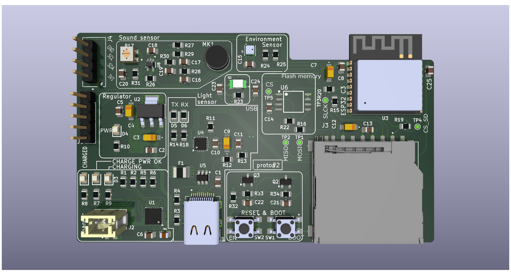

# ESP32-C3-02 IoT Sensor Board

## Overview
This repository contains the KiCad 9.0 design files for a custom IoT sensor board powered by the ESP32-C3-02 SoC[cite: 1]. It features integrated Li-ion battery management and diverse environmental sensors for edge data logging and prototyping[cite: 1].

## Key Features
* **Power Management:** Integrated TP4056 IC for safe single-cell Li-ion charging with thermal regulation, under-voltage lockout, and trickle charging[cite: 1].
* **Dual Power Inputs:** USB-C for charging/data and a dedicated LiPo battery connector[cite: 1].
* **Modular Architecture:** Expandable via additional I2C devices with optimized PCB traces for minimal power loss[cite: 1].

## Primary Components
* **Microcontroller:** ESP32-C3-02 SoC (Wi-Fi and BLE connectivity)[cite: 1].
* **Sensors:** BME280 (temperature, humidity, pressure), ambient light, and sound sensors[cite: 1].
* **Peripherals:** Mini SD card reader, additional flash memory, and I2C OLED display[cite: 1].
* **Charge Indicators:** Dedicated LEDs for charging and full charge status[cite: 1].

## Repository Structure
* `/ESP32 Project Gerbers` - Manufacturing and fabrication files.
* `/Libraries` & `/Project_Library.pretty` - Project-specific symbols and footprints.
* `/Datasheets` - Component documentation[cite: 1].
* `ESP32 sensor board.kicad_pro` - KiCad 9.0 project file.
* `ESP32 sensor board.kicad_pcb` - Physical PCB layout.
* `*.kicad_sch` - Hierarchical schematic design files (Sensors, User Interface, ESP32).
